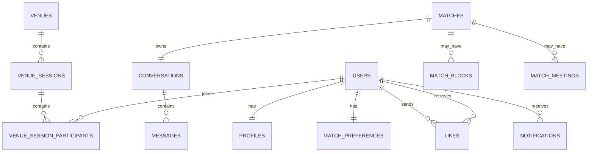

# VibeLink - Database Documentation

## 1. Introduction

La base de données de VibeLink est construite sur PostgreSQL.

Elle a été conçue selon un modèle relationnel normalisé afin de garantir :

- la cohérence des données ;
- la simplicité des relations ;
- la facilité d'évolution ;
- de bonnes performances.

Le modèle actuel correspond au MVP de l'application.

---

# 2. Vue d'ensemble

Le modèle est organisé autour de quatre domaines fonctionnels :

- Gestion des utilisateurs
- Gestion des lieux
- Matching
- Messagerie et notifications

```
USERS

│

├──────── PROFILES

├──────── MATCH_PREFERENCES

├──────── VENUE_SESSION_PARTICIPANTS

├──────── LIKES

├──────── MESSAGES

└──────── NOTIFICATIONS


VENUES

│

└──────── VENUE_SESSIONS

            │

            ├──────── VENUE_SESSION_PARTICIPANTS

            └──────── MATCH_MEETINGS


LIKES

↓

MATCHES

↓

CONVERSATIONS

↓

MESSAGES
```

---

# 3. Tables

---

## USERS

Représente les comptes utilisateurs.

### Responsabilités

- authentification
- autorisation
- rôle utilisateur

### Colonnes principales

- id
- email
- password_hash
- role
- created_at
- updated_at

### Relations

```
USERS

│

├── PROFILE

├── MATCH_PREFERENCES

├── VENUE_SESSION_PARTICIPANTS

├── LIKES

├── MATCHES

├── MESSAGES

└── NOTIFICATIONS
```

---

## PROFILES

Contient les informations publiques d'un utilisateur.

Séparation volontaire entre :

- authentification
- informations visibles

Relation :

```
USERS 1──1 PROFILES
```

---

## MATCH_PREFERENCES

Contient les préférences utilisées par le moteur de matching.

Exemples :

- âge minimum
- âge maximum
- genre recherché

Relation :

```
USERS 1──1 MATCH_PREFERENCES
```

---

## VENUES

Représente les lieux disponibles dans l'application.

Exemples :

- bars
- restaurants
- rooftops
- cafés

Une venue est créée par le back-office.

### Colonnes principales

- name
- category
- address
- city
- latitude
- longitude

Relation :

```
VENUES 1──N VENUE_SESSIONS
```

---

## VENUE_SESSIONS

Une session représente une sortie dans un lieu donné à une date donnée.

Une seule session est créée par lieu et par jour.

Contrainte :

```
UNIQUE(venue_id, session_date)
```

Exemple :

```
Delirium

07/08/2026

19h → fermeture
```

Tous les utilisateurs rejoignent cette même session.

---

## VENUE_SESSION_PARTICIPANTS

Table de liaison entre :

- USERS
- VENUE_SESSIONS

Elle représente la présence d'un utilisateur dans une session.

Elle remplace une table CHECKINS dédiée.

Elle permet de gérer :

- l'inscription
- le check-in
- la présence

Relation :

```
USERS N──N VENUE_SESSIONS
```

---

## LIKES

Historique des likes.

Un utilisateur ne peut liker une autre personne qu'une seule fois.

Contrainte :

```
UNIQUE(sender_id, receiver_id)
```

Relation :

```
USERS N──N USERS
```

---

## MATCHES

Créé automatiquement lorsqu'un like est réciproque.

Relation :

```
LIKES

↓

MATCH
```

Un match possède :

- une conversation
- éventuellement un blocage
- éventuellement une confirmation IRL

---

## MATCH_BLOCKS

Historique des blocages.

Le blocage est volontairement séparé du statut du match.

Pourquoi ?

Parce qu'il faut conserver :

- qui bloque ;
- quand ;
- permettre un déblocage futur.

Relation :

```
MATCHES 1──N MATCH_BLOCKS
```

---

## CONVERSATIONS

Une conversation est créée lorsqu'un match devient actif.

Relation :

```
MATCHES 1──1 CONVERSATIONS
```

---

## MESSAGES

Messages échangés dans une conversation.

Chaque message possède :

- un auteur ;
- une date d'envoi ;
- éventuellement une date de lecture.

Relation :

```
CONVERSATIONS 1──N MESSAGES
```

---

## NOTIFICATIONS

Historique des notifications utilisateur.

Types actuels :

- LIKE_RECEIVED
- MATCH_CREATED
- MESSAGE_RECEIVED
- CHECKIN_REMINDER
- IRL_CONFIRMATION

Les notifications sont persistées afin de pouvoir être consultées ultérieurement.

---

## MATCH_MEETINGS

Table spécifique à VibeLink.

Elle permet de savoir si deux utilisateurs ayant matché se sont réellement rencontrés pendant une session.

Relation :

```
MATCH

        │

        ├──────── Venue Session

        │

        ▼

MATCH_MEETING
```

Chaque utilisateur répond indépendamment.

Exemple :

```
Steve : Oui

Julie : Oui
```

La rencontre est alors confirmée.

---

# 4. Enums

Le projet utilise plusieurs enums PostgreSQL.

## UserRole

```
USER
ADMIN
```

---

## VenueCategory

```
BAR
RESTAURANT
CLUB
CAFE
ROOFTOP
SHOPPING
ENTERTAINMENT
PARC
SPORT
```

---

## VenueSessionStatus

```
PLANNED
ACTIVE
CLOSED
CANCELLED
```

---

## VenueParticipantStatus

```
REGISTERED
CHECKED_IN
NO_SHOW
```

---

## MatchStatus

```
ACTIVE
UNMATCHED
```

---

## NotificationType

```
LIKE_RECEIVED
MATCH_CREATED
MESSAGE_RECEIVED
CHECKIN_REMINDER
IRL_CONFIRMATION
```

---

# 5. Principales contraintes

Le modèle repose sur plusieurs contraintes importantes.

## Une seule session par lieu et par jour

```
UNIQUE(venue_id, session_date)
```

---

## Un seul like entre deux utilisateurs

```
UNIQUE(sender_id, receiver_id)
```

---

## Une seule conversation par match

```
UNIQUE(match_id)
```

---

## Une seule participation par utilisateur dans une session

```
UNIQUE(user_id, venue_session_id)
```

---

## Une seule confirmation IRL par match et par session

```
UNIQUE(match_id, venue_session_id)
```

---

# 6. Flux métier

Le fonctionnement global de la base suit le parcours utilisateur.

```
Création du compte

↓

Création du profil

↓

Inscription à une venue

↓

Participation à une session

↓

Check-in

↓

Découverte des profils

↓

Like

↓

Match

↓

Conversation

↓

Messages

↓

Confirmation de rencontre IRL
```

---

# 7. Évolutions prévues

Le modèle actuel correspond au MVP.

Les évolutions envisagées comprennent notamment :

- administration des venues
- modération
- recommandations IA
- recherche géographique avancée
- statistiques
- analytics
- services temps réel
- architecture distribuée

## Diagramme relationnel

